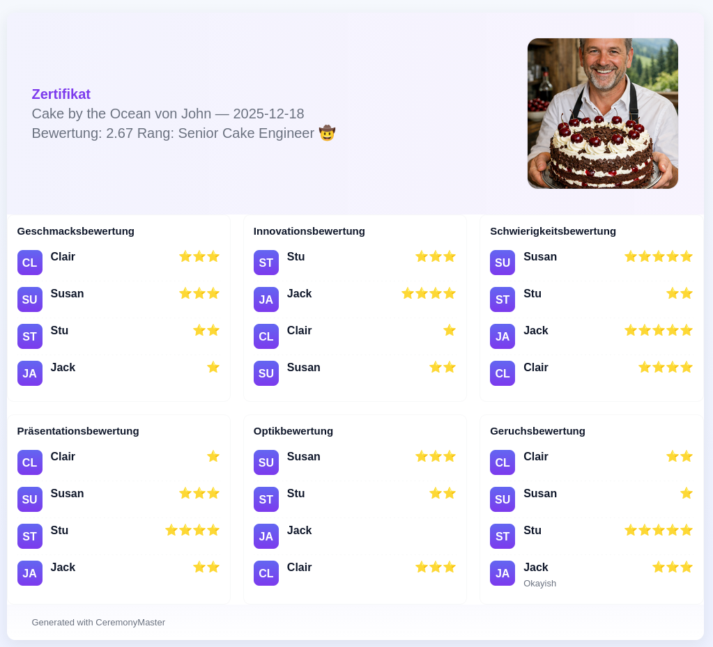

# CeremonyMaster


Tool to conduct pastry tasting an collect in a structure way the feedback from the reviwers.

<h2>Certification Flow:</h2>
<p align="center">
  
</p>

<h2>Print Flow:</h2>
<p align="center">
  
</p>

<h2>Certificate Example:</h2>
<p align="center">
  
</p>

## How It Works

1. Download the binary
2. Run the binary
3. Should be self explanatory

## Certificate PDF Generation

When a certificate is created (after the evaluation summary) the application will save a YAML representation under the certificates directory and render a certificate using an HTML template.

- The editable template is copied to your application directory on first run: `~/.ceremonymaster/templates/certificate.html`.
- If you have `wkhtmltopdf` installed the application will convert the rendered HTML to a PDF automatically. If not, the HTML file is still saved and can be converted manually with your preferred tool.

To customize the certificate layout, edit the template file mentioned above. The template uses Go's `html/template` syntax and the following fields are available:

- `.ID` - certificate UUID
- `.Date` - date (use `{{ .Date.Format "2006-01-02" }}` to format)
- `.Applicant` - applicant name
- `.ObjectName` - evaluated object
- `.Reviewers` - array of reviewer names
- `.Questions` - array of questions; each has `Question` and `Responses`

Example template is provided in `templates/certificate.html` in the repository.

### Template handling (stock vs local)

- On first run the stock template is copied to your application application directory so you can edit it: `~/.ceremonymaster/templates/certificate.html`.
- When printing a certificate the application prefers a local template if present: it checks for `<application-folder>/templates/certificate.html` (for example, next to the YAML certificate file). If that file exists and can be parsed, it will be used instead of the stock/app template.
- If a local template is present but fails to parse, the application logs a warning and falls back to the app-level template (`~/.ceremonymaster/templates/certificate.html`). If the app template cannot be parsed the print operation fails with an error.
- Local templates can reference assets (images, CSS) by relative paths. The generator will reference images next to the certificate output (e.g. `<id>.png`) so placing such assets inside the certificate folder or the local `templates/` directory makes them addressable.
- If a data folder is configured, local templates will be read from `<data-folder>/templates/certificate.html`.

Tip: to customize just one certificate's output, create a `templates/certificate.html` next to that certificate's YAML (and add any local assets in the same folder); the generator will automatically pick it up when printing that certificate.

### Configuration

Once the application was started a configuration file will be created.

```json
{
    "$schema": "http://json-schema.org/draft-06/schema#",
    "$ref": "#/definitions/Welcome1",
    "definitions": {
        "Welcome1": {
            "type": "object",
            "additionalProperties": false,
            "properties": {
                "datacollection": {
                    "type": "array",
                    "items": {
                        "$ref": "#/definitions/Datacollection"
                    }
                },
                "evaluation": {
                    "type": "array",
                    "items": {
                        "$ref": "#/definitions/Evaluation"
                    }
                },
                "skilllevels": {
                    "type": "array",
                    "items": {
                        "$ref": "#/definitions/Skilllevel"
                    }
                }
            },
            "required": [
                "datacollection",
                "evaluation",
                "skilllevels"
            ],
            "title": "Welcome1"
        },
        "Datacollection": {
            "type": "object",
            "additionalProperties": false,
            "properties": {
                "key": {
                    "type": "string"
                },
                "name": {
                    "type": "string"
                },
                "description": {
                    "type": "string"
                },
                "fields": {
                    "type": "array",
                    "items": {
                        "$ref": "#/definitions/DatacollectionField"
                    }
                }
            },
            "required": [
                "description",
                "fields",
                "key",
                "name"
            ],
            "title": "Datacollection"
        },
        "DatacollectionField": {
            "type": "object",
            "additionalProperties": false,
            "properties": {
                "type": {
                    "type": "string"
                },
                "key": {
                    "type": "string"
                },
                "title": {
                    "type": "string"
                },
                "description": {
                    "type": "string"
                },
                "mandatory": {
                    "type": "boolean"
                },
                "options": {
                    "type": "array",
                    "items": {
                        "type": "string"
                    }
                },
                "affirmative": {
                    "type": "string"
                },
                "negative": {
                    "type": "string"
                },
                "require_yes": {
                    "type": "boolean"
                }
            },
            "required": [
                "description",
                "key",
                "mandatory",
                "title",
                "type"
            ],
            "title": "DatacollectionField"
        },
        "Evaluation": {
            "type": "object",
            "additionalProperties": false,
            "properties": {
                "key": {
                    "type": "string"
                },
                "name": {
                    "type": "string"
                },
                "description": {
                    "type": "string"
                },
                "fields": {
                    "type": "array",
                    "items": {
                        "$ref": "#/definitions/EvaluationField"
                    }
                }
            },
            "required": [
                "description",
                "fields",
                "key",
                "name"
            ],
            "title": "Evaluation"
        },
        "EvaluationField": {
            "type": "object",
            "additionalProperties": false,
            "properties": {
                "type": {
                    "$ref": "#/definitions/Type"
                },
                "key": {
                    "$ref": "#/definitions/Key"
                },
                "title": {
                    "type": "string"
                },
                "description": {
                    "type": "string"
                },
                "mandatory": {
                    "type": "boolean"
                },
                "weight": {
                    "type": "integer"
                }
            },
            "required": [
                "description",
                "key",
                "mandatory",
                "title",
                "type"
            ],
            "title": "EvaluationField"
        },
        "Skilllevel": {
            "type": "object",
            "additionalProperties": false,
            "properties": {
                "level": {
                    "type": "integer"
                },
                "name": {
                    "type": "string"
                },
                "description": {
                    "type": "string"
                },
                "min_points": {
                    "type": "number"
                }
            },
            "required": [
                "description",
                "level",
                "min_points",
                "name"
            ],
            "title": "Skilllevel"
        },
        "Key": {
            "type": "string",
            "enum": [
                "rating",
                "comment"
            ],
            "title": "Key"
        },
        "Type": {
            "type": "string",
            "enum": [
                "range",
                "text"
            ],
            "title": "Type"
        }
    }
}
```